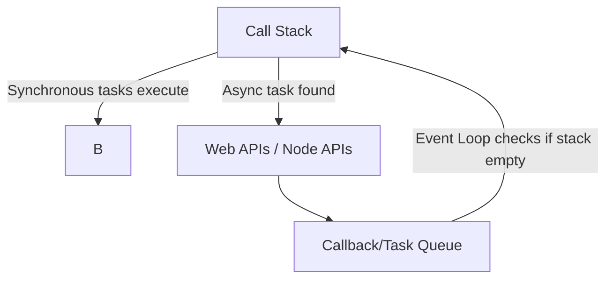

# JavaScript: Synchronous vs Asynchronous

JavaScript ek **single-threaded** language hai, iska matlab ek waqt mai sirf ek hi kaam hota hai. Lekin asynchronous features (Promises, Async/Await, Callbacks) ki wajah se hum multiple tasks efficiently handle kar sakte hain.

---

## 1. Synchronous Code

**Definition:** Code line by line execute hota hai, aur agla step tab tak nahi chalta jab tak pehla complete na ho jaye.

### Example 1:

```js
console.log("Step 1");
console.log("Step 2");
console.log("Step 3");
```

**Output:**

```
Step 1
Step 2
Step 3
```

👉 Yeh ekdum sequence mai execute hua.

### Example 2 (Blocking):

```js
function longTask() {
  for (let i = 0; i < 1e9; i++) {} // heavy loop
  console.log("Long Task Done");
}

console.log("Start");
longTask();
console.log("End");
```

**Output:**

```
Start
Long Task Done
End
```

👉 Notice karo ke "End" tab tak nahi aaya jab tak long task complete nahi hua.

---

## 2. Asynchronous Code

**Definition:** Non-blocking code jisme program ek task ke wait karte hue bhi dusre kaam kar sakta hai.

### Example 1: Using `setTimeout`

```js
console.log("Task 1");

setTimeout(() => {
  console.log("Task 2 (after 2 sec)");
}, 2000);

console.log("Task 3");
```

**Output:**

```
Task 1
Task 3
Task 2 (after 2 sec)
```

👉 Task 2 background mai gaya aur baad mai execute hua.

### Example 2: API Call Simulation

```js
console.log("Fetching user...");

setTimeout(() => {
  console.log("User data received");
}, 3000);

console.log("Continue other work...");
```

**Output:**

```
Fetching user...
Continue other work...
User data received
```

👉 User data wait karte waqt program free tha dusre kaam karne ke liye.

---

## 3. Callback Hell

Callbacks asynchronous tasks handle karte hain, lekin jab zyada nested callbacks ho jate hain to code messy ban jata hai.

### Example:

```js
getUser(function(user) {
  getPosts(user.id, function(posts) {
    getComments(posts[0].id, function(comments) {
      console.log("Comments:", comments);
    });
  });
});
```

👉 Is tarah ke nested structure ko **callback hell** kehte hain, jo samajhna mushkil ho jata hai.

---

## 4. Promises

**Definition:** Promise ek object hai jo ek asynchronous operation ka result represent karta hai. Iske teen states hoti hain:

* **Pending** (initial state)
* **Fulfilled** (success)
* **Rejected** (error)

Promise ka **result hamesha `.then()` ya `.catch()` ke through milta hai**, direct variable mai return nahi hota.

### Example 1: Basic Promise

```js
let promise = new Promise((resolve, reject) => {
  let success = true;

  if(success) {
    resolve("Task completed successfully");
  } else {
    reject("Task failed");
  }
});

promise
  .then(result => console.log("Result:", result))
  .catch(error => console.log("Error:", error));
```

**Output:**

```
Result: Task completed successfully
```

👉 Promise ka result **`.then()` ke andar milta hai**. Agar error aata hai to wo `.catch()` mai milta hai.

### Example 2: API Simulation

```js
function fetchUser() {
  return new Promise(resolve => {
    setTimeout(() => {
      resolve({ id: 1, name: "Shahbaz" });
    }, 2000);
  });
}

fetchUser()
  .then(user => console.log("User:", user))
  .catch(err => console.log("Error:", err));
```

**Output:**

```
User: { id: 1, name: "Shahbaz" }
```

---

## 5. Async/Await

**Definition:** `async/await` Promises ke upar ek syntax sugar hai jo asynchronous code ko synchronous jaisa readable banata hai.

### Why Use Async/Await?

* Code clean aur readable hota hai
* Nested `.then()` chains se bach jaate hain
* Error handling easy hoti hai with `try...catch`

### Example 1:

```js
function fetchData() {
  return new Promise(resolve => {
    setTimeout(() => resolve("Data received"), 2000);
  });
}

async function getData() {
  console.log("Fetching...");
  const result = await fetchData(); // wait until resolved
  console.log(result);
}

getData();
```

**Output:**

```
Fetching...
Data received
```

👉 `await` ke wajah se function pause hua jab tak promise resolve nahi hua.

### Example 2: Multiple Await

```js
function task(msg, time) {
  return new Promise(resolve => {
    setTimeout(() => resolve(msg), time);
  });
}

async function runTasks() {
  const step1 = await task("Step 1 complete", 1000);
  console.log(step1);

  const step2 = await task("Step 2 complete", 2000);
  console.log(step2);

  const step3 = await task("Step 3 complete", 1500);
  console.log(step3);
}

runTasks();
```

**Output:**

```
Step 1 complete
Step 2 complete
Step 3 complete
```

---

## 6. Event Loop Diagram



👉 Event Loop ensure karta hai ke asynchronous tasks tabhi execute ho jab call stack empty ho.

---

## 7. Conclusion

* **Synchronous**: Blocking, line by line execution
* **Asynchronous**: Non-blocking, allows multitasking
* **Callback Hell**: Complicated nested callbacks
* **Promises**: Cleaner way, result `.then()` or `.catch()` mai milta hai
* **Async/Await**: Easy to read & maintain, synchronous style async code

**Rule of Thumb:**
Always prefer **Promises** or **Async/Await** over raw callbacks for better readability aur maintainability.
